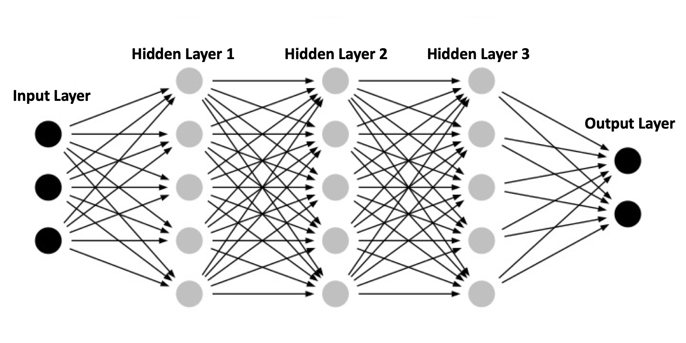
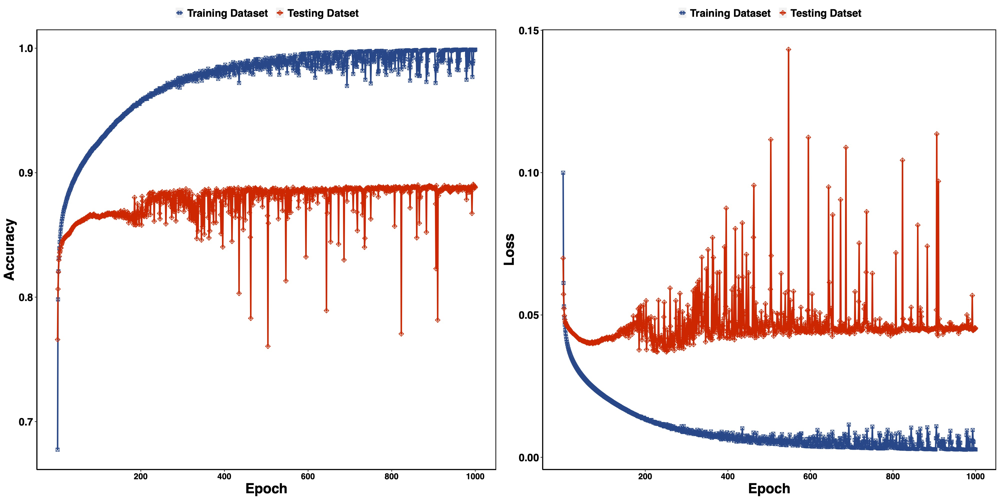
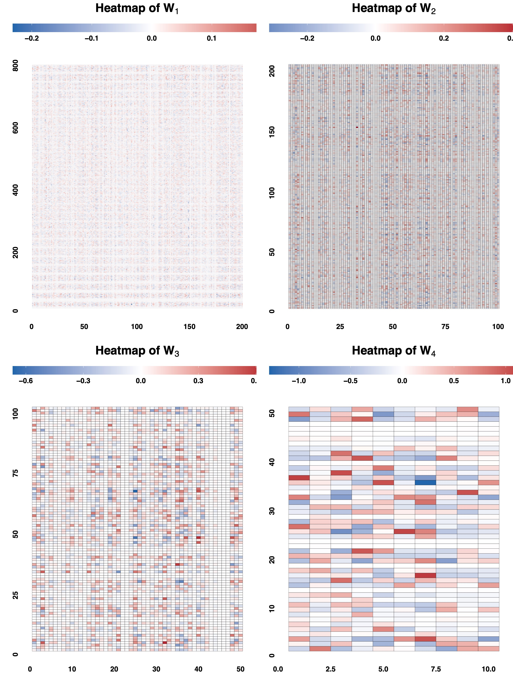

# NNDL_HW1

## 0. 简介

本项目手动实现带 3 个隐藏层的 MLP并在[Fashion-MNIST](https://github.com/zalandoresearch/fashion-mnist)数据集上训练，模型结构为：


## 1. 代码结果：

代码总共有三部分，主程序为`main.py`，其余的`model.py`为模型结构，`utils.py`为一些必要函数的实现

## 2. 运行逻辑

支持运行三种任务：训练、测试和参数查找：

- 测试
```bash
python main.py --task test --data_path your_data_path --model_weight_path your_trained_weights.npy
```
- 训练
```bash
python main.py --task train --data_path your_data_path --epochs 100 --hidden "20 10 5" --activation relu --batch_size 128 --initial_lr 0.001 --lr_decay_rate 0.99 --lambda_L2 0.1 --lr_strategy step_decay --save_path ./train_model_save --early_stopping --patience 5
```
- 参数查找
```bash
python main.py --task param_find --data_path your_data_path --epochs 100 --hidden_cand "20 20 5,5 10 20" --lr_cand "0.01 0.001" --reg_cand "0.01 0.001" --batch_size_cand "128 256" --activation_cand "relu tanh"
```

**在运行前需要注意这几个部分要把路径设置为自己的路径**

## 3. 一些结果

- 测试：如果用我提供的`best_weights.npy`做测试输出的结果为：
```bash
===== The Testing Accuracy is 0.8906 and the Testing Loss is 0.0447! =====
```

- 训练：
  - 训练得到的损失曲线与准确率曲线：
  
  - 参数权重热力图
  
